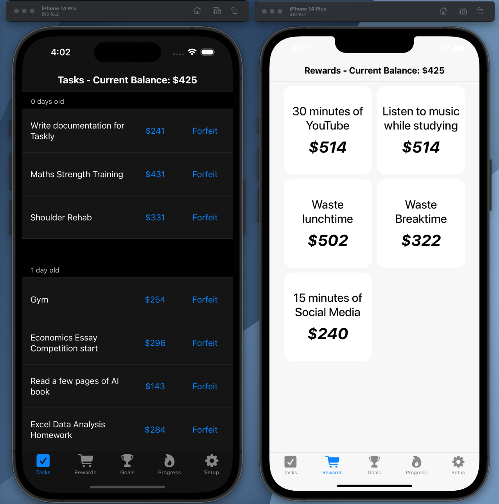
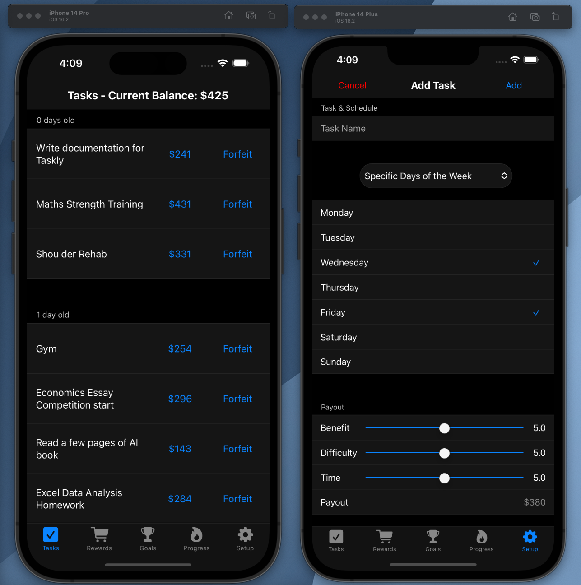
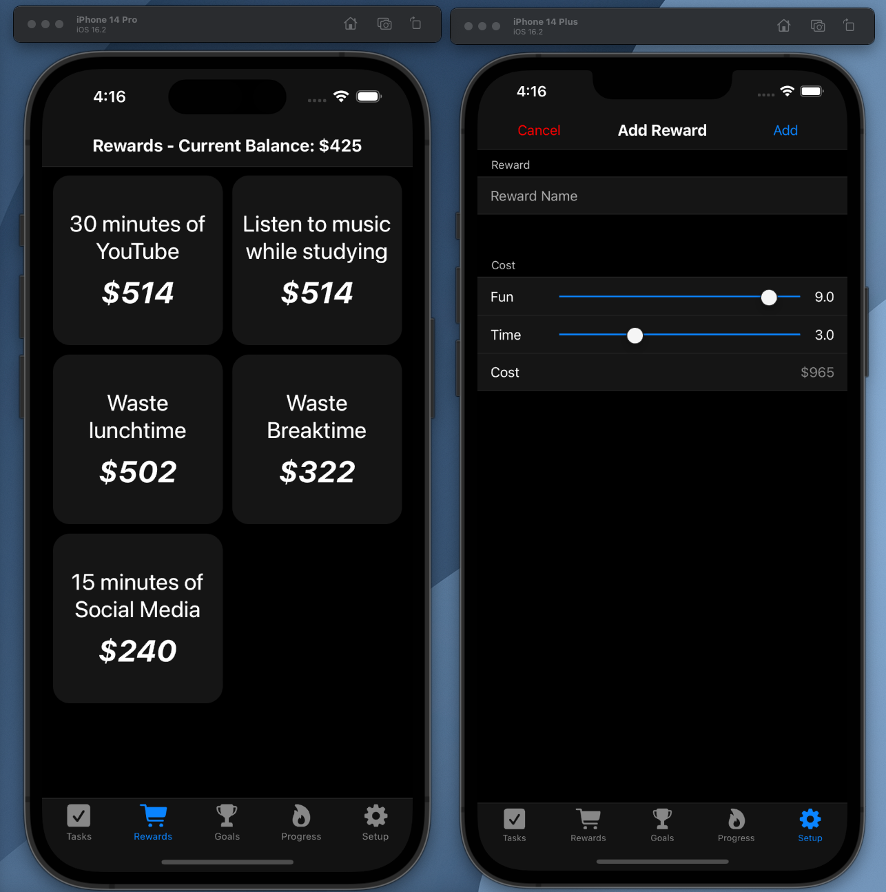
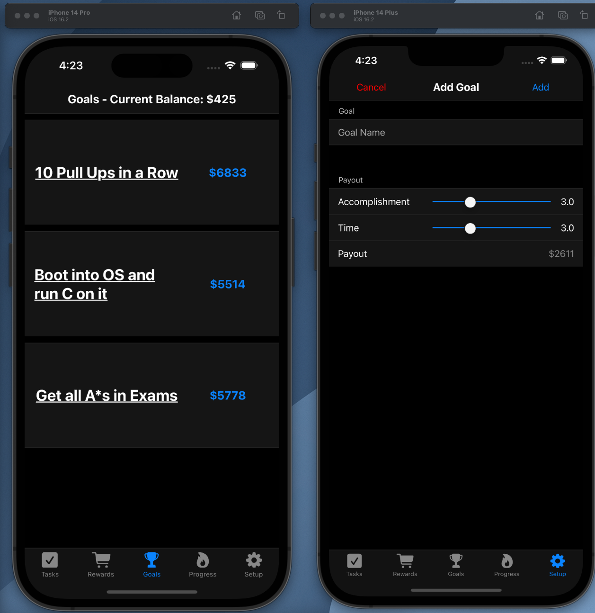
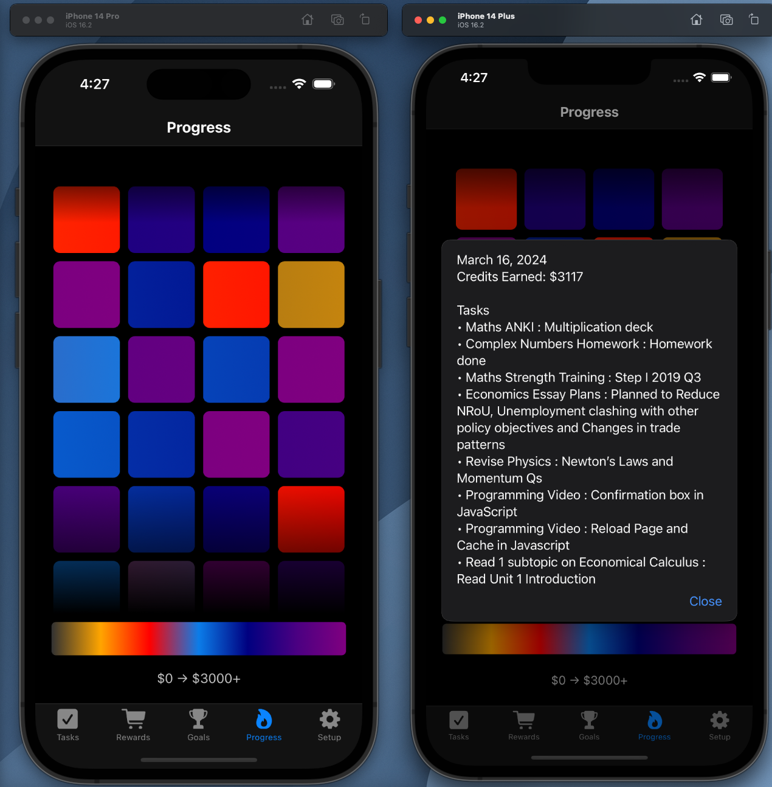

# Taskly 

### An app which gamifies completing daily tasks and habits providing credits, which you can then use to buy rewards and hence improve productivity

For research and documentation of development, please read the [Research PDF](Research.pdf)

### URL: https://aryaask.github.io/Taskly/dist/
*Taskly is built using vanilla HTML, JS and CSS and currently is distributed as a PWA through the [Native CSS](https://github.com/AryaaSk/Native) framework. If you wish to 'install' the app locally to your mobile device, open the website, click share and then add to homescreen (iOS); for Android there should be an install button around the search bar.*

## How it works
**Utilise your brain's desires as incentive to complete all your daily tasks and habits**. This is achieved through the credit system which rewards credits if you complete tasks and deplets credits in order to 'indulge' in a reward. \
*Note: There is no actual mechanism to stop you from illegitimately claiming rewards. This app relys on willpower to be functional, but instead provides a framework to reap these benefits*

### Tasks
These are the tasks and habits which you need to get done everyday. There are different ways of scheduling a task, depending on whether it is periodic (needs to be every x days), on specific days of the week, or even a one-time task (e.g. complete an assignment).

On completing a task you will be asked for a quick summary of what you did - this is a 'pseudo-verification' tactic to attempt to prevent you from breaking trust and thus making the app useless.

There is also a forfeit button if the task becomes overwehlming or unnecessary - this should rarely be used as tasks should have sufficient incentive based on their importance as their payout.

Speaking of payouts, a task's payout is determined by 3 inputs: benefit, difficulty and time. The exact formula and its derivation is explained in the [Research PDF](ResearchPDF.pdf).

All scales are meant to be linear and exponential weightage is implicit within the payout function.

The payout of a task also decreases exponentially as it goes overdue - Look at the research PDF for a specific decay curve.

### Rewards
Cash in your hand earned credits on rewards.

After earning credits through either tasks or goals (next), you can spend on a fun reward. These keep incentive strong to complete tasks and therefore act as powerful motivators.

It is important you don't leave any potential source of enjoyment in your daily life out of the rewards sections, as these can lead to 'externalities' - rewarding yourself without earning it through tasks. Too many externalities can lead to a sense of distrust between the app and your daily habits, eventually rendering the app useful for its intended purpose.

The cost of rewards is explictly designed to generally be higher than that of a task's payout, as this ensures you are always spending more time completing tasks than doing rewards. Sounds grim at first, but eventually it lowers your baseline dopamine and hence improves your productivity in the long run.

Speaking of costs, the reward cost function is similar to the tasks payout function, except there are now only two variables: fun/enjoyment and time. To learn about the cost function, read the [Research PDF](ResearchPDF.pdf).

### Goals

Goals are very similar to tasks, however they do not have a specific date to be achieved and therefore do not decay.

Furthermore, the payout of a goal is dependant on 'accomplishment' and 'time' (a much longer time span than that of a reward 'time' variable); a goal's payout is overtly designed to be of a greater magnitude than that of tasks, since goals do not repeat and are generally only achieved once in a while.

Therefore, it's imperative that you as a user don't abuse the goals and only set them for very important milestones.

### Progress
This is a simple screen which allows you to track your progress overtime, hence providing long term motivation to continue building good habits.

I still use this app to this day (04/04/2024) and highly recommend it if you are willing to setup your routines and stick to the credits system (remove all externalities).

## Todo
 - **Convert to iOS 'app' and add interactive Widget**: Create a native iOS wrapper with a WebView and display the page through there (similar to [Speedy Maths](https://github.com/AryaaSk/SpeedyMaths)). This will allow the app to be downloadable from the iOS app store, and also allow me to add an interactive widget to quickly sign off tasks and claim rewards.

 - **Add ability to edit Tasks, Rewards and Goals once created**

 - **Investigate further reinforcement strategies**: Users shouldn't need to rely on their willpower to prevent externalities/dishonest behaviour. Perhaps later on I can implement mechanisms similar to apps like 'Forfeit' and 'One Sec' (iOS app store) to prevent this breaking behaviour.

 - **Dynamic progress credits range**: Change the range depending on the average credits earned, to ensure all users have a varied progress tab and to promote continuous productivity development.

 - **More Payout Damping Functions**: Currently there is only exponential decay, however in the future I may add other forms of damping and the ability for the user to customise their damping functions.

 - **Fix bug where progress page doesn't dispaly properly on Mozilla Firefox**: This occurs because of a CSS formatting difference specific to Mozilla.